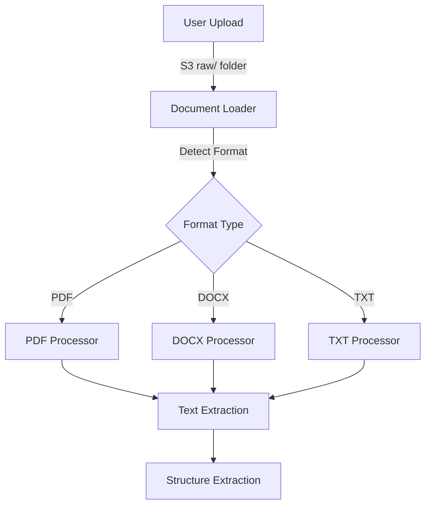

# System Architecture

This document provides a comprehensive overview of the Resume Parser & Matching System architecture.

## High-Level Architecture

The system is built with a modular, microservices-inspired architecture that separates concerns for scalability and maintainability. It consists of several key components:


## Core Components

### 1. Resume Processing Pipeline

The resume processing pipeline handles document ingestion, text extraction, structured data extraction, and storage.

Key modules:
- **Document Loader**: Handles document retrieval from S3 and format detection
- **Text Extractor**: Converts various document formats to plain text
- **Resume Parser**: Extracts structured information from raw text
- **Embedding Generator**: Creates vector embeddings for semantic search
- **Storage Manager**: Coordinates storage across multiple backends

### 2. Vector Search Engine

The vector search engine enables semantic matching between job descriptions and resumes.

Key components:
- **OpenSearch Client**: Interfaces with Amazon OpenSearch Service
- **Vector Index**: HNSW-based nearest neighbor search index
- **Query Processor**: Transforms job descriptions into effective search queries
- **Result Formatter**: Structures and normalizes search results

### 3. Reranking System

The reranking system improves search results by incorporating multiple relevance signals.

Key features:
- **Multi-factor Scoring**: Combines vector similarity, skill matching, experience, and recency
- **Weighted Ranking**: Configurable weights for different ranking factors
- **Thresholding**: Minimum requirements filtering
- **Score Normalization**: Standardized scoring across factors

### 4. Storage Layer

The system uses multiple storage backends optimized for different data types:

- **Amazon S3**: Raw and processed resume documents
- **OpenSearch**: Vector embeddings and searchable structured data
- **PostgreSQL** (optional): PII data and detailed candidate information
- **DynamoDB** (optional): Structured resume data with key-value access pattern

### 5. API Layer

The system exposes functionality through a command-line interface but is designed with API patterns for future expansion.

## Data Flow

### Resume Processing Flow

1. User uploads resumes to S3 bucket in the `raw/` prefix
2. `parse_resume.py` script initiates the processing pipeline
3. Documents are downloaded from S3 to a temporary local cache
4. Text extraction is performed based on document format:
   - PDF: PyMuPDF + Tesseract OCR (for image-based PDFs)
   - DOCX: docx2txt
   - TXT: Direct reading
5. Structured information is extracted using NLP techniques
6. Vector embeddings are generated using AWS Bedrock
7. Data is stored in multiple backends:
   - Structured data → PostgreSQL/DynamoDB
   - Vector embeddings → OpenSearch
   - Processed files → S3 `processed/` prefix
8. Processing status and metadata are logged

### Job Description Matching Flow

1. User provides a job description file
2. `retrieve_jd_matches.py` processes the job description
3. Key requirements are extracted (skills, experience, etc.)
4. The job description is converted to a vector embedding
5. Initial candidate retrieval occurs through vector search
6. Retrieved candidates are reranked based on multiple factors
7. Final results are sorted and filtered
8. Results are output as structured JSON

## Component Details

### Resume Document Loader



The Document Loader component handles different document formats, performing format-specific processing to standardize inputs for the parsing stage.

### Resume Parser

The Resume Parser uses a combination of rule-based extraction, NLP techniques, and machine learning to convert unstructured resume text into structured data.

Key extraction capabilities:
- Contact information (name, email, phone, LinkedIn)
- Skills and technologies
- Work experience and positions
- Education and certifications
- Projects and accomplishments

### Vector Embedding System

The Vector Embedding System generates high-dimensional vector representations of resumes and job descriptions:

1. Text standardization occurs to normalize input format
2. AWS Bedrock embedding models transform text to vectors
3. Vectors are normalized for cosine similarity comparison
4. Embeddings are stored in OpenSearch with kNN configuration
5. Optimized nearest-neighbor search enables fast retrieval

For detailed information about the vector embedding system, see [Vector Embedding Framework](../technical-docs/vector-embedding-framework.md).

### OpenSearch Integration

The system interfaces with Amazon OpenSearch Service for vector storage and retrieval:

```python
# Index configuration
index_config = {
    "settings": {
        "index": {
            "knn": True,
            "knn.algo_param.ef_search": 512
        }
    },
    "mappings": {
        "properties": {
            "resume_id": {
                "type": "keyword"
            },
            "resume_embedding": {
                "type": "knn_vector",
                "dimension": 1024,
                "method": {
                    "name": "hnsw",
                    "space_type": "cosinesimil"
                }
            }
            # Additional fields...
        }
    }
}
```

Key optimizations:
- HNSW algorithm for efficient approximate nearest neighbor search
- Cosine similarity space for normalized vector comparison
- Configurable search parameters for precision/recall trade-offs
- Field-based filtering to combine vector and structured queries

### Storage Strategy

The system uses a multi-tiered storage strategy:

1. **S3 Storage**: 
   - Raw resume documents
   - Processed resume text
   - Extraction results cache
   - Large batch processing results

2. **OpenSearch**:
   - Vector embeddings
   - Resume skill lists
   - Experience summaries
   - Searchable structured data

3. **PostgreSQL** (optional):
   - Personally Identifiable Information (PII)
   - Detailed candidate profiles
   - Complex relational data
   - Historical processing records

4. **DynamoDB** (optional):
   - Key-value structured resume data
   - Fast lookups by resume_id
   - Processing status tracking
   - Metadata and indexing information

### Reranking System

The reranking system improves match quality through a multi-stage process:

1. **Initial Retrieval**: Get top-N candidates via vector similarity
2. **Component Scoring**: Calculate individual factor scores
   - Vector similarity score
   - Skill match score
   - Experience match score
   - Recent experience score
3. **Score Combination**: Apply weighted formula to component scores
4. **Filtering**: Remove candidates below minimum thresholds
5. **Final Ranking**: Sort by combined score

For detailed information, see [Reranking Algorithm](../technical-docs/reranking-algorithm.md).

## Technical Stack

### Core Technologies

- **Programming Language**: Python 3.9+
- **Cloud Platform**: AWS (S3, Bedrock, OpenSearch, DynamoDB)
- **Vector Database**: Amazon OpenSearch Service
- **Relational Database**: PostgreSQL (optional)
- **NoSQL Database**: DynamoDB (optional)
- **Text Processing**: SpaCy, NLTK, PyMuPDF
- **OCR**: Tesseract OCR via pytesseract
- **Document Processing**: pdf2image, docx2txt, PyMuPDF
- **Embeddings**: AWS Bedrock (Titan Embed, Claude, Llama)

### Key Dependencies

- **boto3**: AWS SDK for Python
- **opensearch-py**: OpenSearch client
- **psycopg2-binary**: PostgreSQL client
- **python-dotenv**: Environment configuration
- **spacy**: NLP processing
- **numpy/pandas**: Data manipulation
- **pdfminer.six**: PDF text extraction
- **pytesseract**: OCR processing
- **fitz/PyMuPDF**: PDF handling

## Deployment Architecture

The system is designed for flexible deployment options:

### Single-Machine Deployment

For smaller-scale operations, the entire system can run on a single machine:

```
┌─────────────────────────────────────┐
│  Resume Parser & Matching System    │
│                                     │
│  ┌─────────┐     ┌───────────────┐  │
│  │ Parser  │◄──►│ Local Storage  │  │
│  └─────────┘     └───────────────┘  │
│                                     │
│  ┌─────────┐     ┌───────────────┐  │
│  │Retriever│◄──►│   AWS Client   │  │
│  └─────────┘     └───────────────┘  │
│                                     │
└──────────────────┬──────────────────┘
                   │
                   ▼
┌─────────────────────────────────────┐
│           AWS Services              │
│                                     │
│  ┌─────────┐     ┌───────────────┐  │
│  │   S3    │     │  OpenSearch   │  │
│  └─────────┘     └───────────────┘  │
│                                     │
│  ┌─────────┐     ┌───────────────┐  │
│  │ Bedrock │     │   DynamoDB    │  │
│  └─────────┘     └───────────────┘  │
│                                     │
└─────────────────────────────────────┘
```

### Distributed Deployment

For production or higher scale:

```
┌─────────────────┐  ┌─────────────────┐  ┌─────────────────┐
│ Resume Parser 1 │  │ Resume Parser 2 │  │ Resume Parser N │
└────────┬────────┘  └────────┬────────┘  └────────┬────────┘
         │                    │                    │
         └──────────┬─────────┴──────────┬─────────┘
                    │                    │
         ┌──────────▼────────┐  ┌────────▼──────────┐
         │   Parser Queue    │  │  Results Storage  │
         └──────────┬────────┘  └──────────┬────────┘
                    │                      │
                    │                      │
┌───────────────────▼──────────────────────▼───────────────────┐
│                                                             │
│                       AWS Services                          │
│                                                             │
└─────────────────────────────────────────────────────────────┘
                           │
              ┌────────────▼───────────────┐
              │                            │
  ┌───────────▼────────┐   ┌───────────────▼────┐
  │ JD Retriever API   │   │ Admin Dashboard    │
  └────────────────────┘   └────────────────────┘
```

## Scaling Considerations

The system is designed with scalability in mind:

### Horizontal Scaling

- Stateless parsing components can be replicated
- Processing can be distributed across multiple machines
- S3 and cloud databases scale automatically

### Vertical Scaling

- Vector processing benefits from increased CPU/RAM
- OCR processing benefits from GPU acceleration
- Embedding generation benefits from optimized hardware

### Performance Optimizations

- **Caching**: Multiple caching layers reduce redundant processing
- **Batch Processing**: Large resume sets are processed in batches
- **Parallel Processing**: Multiple files can be processed concurrently
- **Query Optimization**: OpenSearch queries are optimized for performance

## Security Architecture

The system incorporates several security measures:

### Data Protection

- **PII Separation**: Personal information stored separately from vector data
- **Encryption**: Data encrypted in transit and at rest
- **Access Control**: IAM policies limit access to AWS resources
- **Credential Management**: No hardcoded credentials, using environment variables

### Key Security Features

1. **S3 Security**:
   - Server-side encryption
   - Bucket policies restricting access
   - Access logging enabled

2. **OpenSearch Security**:
   - Domain with VPC or IP-based restrictions
   - HTTPS for all communications
   - IAM authentication

3. **Database Security**:
   - Password authentication
   - Encrypted connections
   - Minimal permission grants

## Monitoring and Logging

The system includes comprehensive logging:

- **Application Logs**: Detailed operation logging to files
- **Error Handling**: Structured error capture and reporting
- **Processing Metrics**: Performance tracking for optimization
- **AWS CloudWatch** (optional): Metrics and log aggregation
- **Audit Trail**: Record of all processing actions

## Future Architecture Extensions

The architecture is designed for future enhancements:

1. **API Gateway**: RESTful API for remote access
2. **Web UI**: Administrative interface for system management
3. **Real-time Processing**: Stream processing of incoming resumes
4. **Multi-region Deployment**: Distributed across AWS regions
5. **Containerization**: Docker packaging for easier deployment
6. **Feedback Loop**: Integration of user feedback into ranking

## References

- [AWS Architecture Best Practices](https://aws.amazon.com/architecture/well-architected/)
- [Vector Database Design Patterns](https://opensearch.org/docs/latest/search-plugins/knn/index/)
- [Microservices Architecture Patterns](https://microservices.io/patterns/index.html)
- [Scaling Python Applications](https://realpython.com/python-concurrency/)
- [AWS Bedrock Documentation](https://aws.amazon.com/bedrock/) 